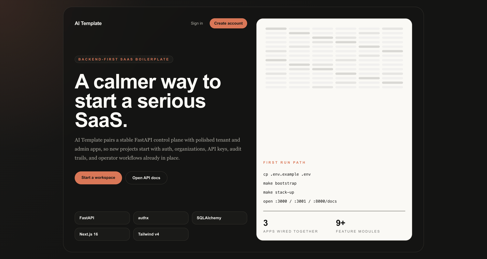

# AI Template

> Multi-tenant SaaS boilerplate built on FastAPI + [authx](https://github.com/yezz123/authx) + Next.js. Every feature toggleable via env vars; ship a production-ready SaaS in a weekend.

[](https://github.com/yezz123/ai-template/actions/workflows/backend.yaml)
[](https://github.com/yezz123/ai-template/actions/workflows/frontend.yaml)
[](https://github.com/yezz123/ai-template/actions/workflows/admin.yaml)

<!-- markdownlint-disable MD033 -->
<p align="center">
  
</p>

<p align="center">
  <strong>A polished SaaS starter with a FastAPI control plane, tenant app, and admin portal.</strong>
</p>
<!-- markdownlint-enable MD033 -->

## What you get

- **Organizations / Workspaces** with per-org data isolation (every tenant row carries `org_id`).
- **Roles**: Owner / Admin / Member, mapped to authx **scopes** with wildcard support (`org:members:*`).
- **JWT scoped to org** &mdash; switch orgs and the access token is re-issued with the new `org_id` and computed scopes.
- **API keys per organization** with scoped permissions, validated via `X-API-Key`.
- **Email invitations** &mdash; or token-link only when email delivery is disabled.
- Optional, all gated by `FEATURE_*` env vars: OAuth (Google/GitHub), magic-link, real email delivery (Resend/SMTP), Stripe billing, Pydantic AI + LLM Gateway (chat + demo agents), Logfire observability, audit log, rate limiting.

## Repository layout

```text
ai-template/
├── backend/         FastAPI + authx + SQLAlchemy + Alembic (uv-managed)
├── frontend/        Next.js 16 tenant-facing app (Tailwind v4, Framer Motion, Zod)
├── admin/           Next.js 16 super-admin portal
├── infra/           docker-compose + postgres init
├── .env.example     every FEATURE_* and secret in one place
└── Makefile         `make dev`, `make test`, `make migrate`, ...
```

## Stack

| Layer        | Tech                                                                                                                        |
| ------------ | --------------------------------------------------------------------------------------------------------------------------- |
| Backend      | FastAPI, Pydantic v2, [authx](https://pypi.org/project/authx/) 1.6.0, SQLAlchemy 2 async, Alembic, Postgres 17, Redis 7, uv |
| Frontend     | Next.js 16, React 19, Tailwind v4, Framer Motion, Zod, bun                                                                  |
| Admin Portal | Next.js 16, React 19, Tailwind v4, Framer Motion, Zod, bun                                                                  |
| Optional     | Pydantic AI, LLM Gateway, Pydantic Logfire, Resend, Stripe, Authlib                                                         |

## Quick start

Prereqs: **uv** &ge; 0.5, **bun** &ge; 1.3, **Docker**.

### Option A: run everything with Docker (recommended)

```bash
git clone https://github.com/yezz123/ai-template && cd ai-template
cp .env.example .env

make stack-build
make stack-up
make stack-create-admin email=admin@example.com password=change-me-admin-password
make stack-ps
```

- Gateway: `http://localhost:8080` (Nginx, set `NGINX_PORT` in `.env`)
- Gateway Admin: `http://localhost:8080/admin/`
- Gateway API docs: `http://localhost:8080/docs`
- Backend: `http://localhost:8000` (OpenAPI UI: `http://localhost:8000/docs`)
- Liveness: `http://localhost:8000/healthz`
- Readiness: `http://localhost:8000/readyz`
- Frontend: `http://localhost:3000`
- Admin: `http://localhost:3001`
- Mailpit: `http://localhost:8025`

```bash
make stack-logs
```

Docker Compose is run through `make` with `--env-file .env`, so copy
`.env.example` to `.env` before building or starting the stack. If `.env` is
missing, the Makefile falls back to `.env.example` for smoke testing.

### Option B: run infra in Docker + apps locally (fast inner loop)

```bash
git clone https://github.com/yezz123/ai-template && cd ai-template
cp .env.example .env

make bootstrap          # uv sync + bun install
make up                 # postgres + redis + mailpit
make migrate            # alembic upgrade head
make create-admin email=admin@example.com password=change-me-admin-password

# In three separate terminals:
make dev-backend        # http://localhost:8000  (FastAPI + /docs)
make dev-frontend       # http://localhost:3000  (tenant app)
make dev-admin          # http://localhost:3001  (super-admin)
```

### First 10 minutes

1. Copy `.env.example` to `.env` and keep the default local values.
2. Run `make bootstrap`, `make up`, then `make migrate`.
3. Create the first operator: `make create-admin email=admin@example.com password=change-me-admin-password`.
4. Start `make dev-backend`, `make dev-frontend`, and `make dev-admin` in separate terminals.
5. Open `http://localhost:3000` to register and create your first organization.
6. Open `http://localhost:8000/docs` to inspect the API contract.
7. Open `http://localhost:3001` and sign in with the super-admin credentials.

## Super-admin bootstrap

Create or promote an admin locally:

```bash
make create-admin email=admin@example.com password=change-me-admin-password
```

Run the same bootstrap through Docker Compose:

```bash
make stack-create-admin email=admin@example.com password=change-me-admin-password
```

The underlying Typer command is idempotent and can also read env vars:

```bash
cd backend
ADMIN_EMAIL=admin@example.com ADMIN_PASSWORD=change-me-admin-password uv run dogeapi admin create
```

## Nginx gateway

The Docker stack includes an Nginx gateway on `NGINX_PORT` (`8080` by default):

- `/` proxies to the tenant frontend.
- `/admin/` proxies to the admin portal.
- `/api/backend/*`, `/docs`, `/openapi.json`, `/healthz`, and `/readyz` proxy to FastAPI.

This avoids browser/server confusion around `localhost` inside containers. The
frontend and admin containers talk to `INTERNAL_API_BASE_URL`
(`http://backend:8000` by default), while host-local development can keep
`NEXT_PUBLIC_API_BASE_URL=http://localhost:8000`.

## Feature flags

Every optional module is gated by an env var. Disabled features incur **zero**
runtime cost &mdash; their routers are never registered, their dependencies never
imported.

| Flag                     | Default | Module                         |
| ------------------------ | ------- | ------------------------------ |
| `FEATURE_API_KEYS`       | `true`  | API keys per org (`X-API-Key`) |
| `FEATURE_AUDIT_LOG`      | `true`  | Audit log of mutations         |
| `FEATURE_RATE_LIMITING`  | `true`  | authx `RateLimiter` + Redis    |
| `FEATURE_OAUTH`          | `false` | Google + GitHub via Authlib    |
| `FEATURE_MAGIC_LINK`     | `false` | Passwordless                   |
| `FEATURE_EMAIL_DELIVERY` | `false` | Resend / SMTP                  |
| `FEATURE_AI_CHAT`        | `false` | Pydantic AI + LLM Gateway      |
| `FEATURE_LOGFIRE`        | `false` | Pydantic Logfire tracing       |
| `FEATURE_STRIPE`         | `false` | Per-org subscriptions          |

Optional Python deps live behind `pyproject.toml` extras:

```bash
uv sync --extra ai --extra stripe       # only what you need
uv sync --extra all                     # everything
```

Frontend and Admin feature visibility is gated by `NEXT_PUBLIC_FEATURE_*` vars
which are baked into the Next.js bundle at build time (see `.env.example`).

## Production readiness checks

- `/healthz` is a lightweight liveness probe.
- `/readyz` checks Postgres and Redis and reports `ready` or `degraded`.
- `APP_ENV=production` rejects placeholder JWT secrets and requires secure auth cookies.
- Optional integrations validate required secrets when their `FEATURE_*` flags are enabled outside tests.

## Multi-tenancy model

- Shared database, shared schema. Every tenant row has `org_id UUID NOT NULL` with composite indexes.
- The active org lives in the JWT (`data.org_id` + `data.role` + `scopes`).
- `current_org` FastAPI dep extracts the org from the token and every repository function takes it as a required argument.
- `POST /orgs/{slug}/switch` re-issues the token pair with new claims.

## Roles &rarr; scopes

```python
ROLE_SCOPES = {
    Role.OWNER:  ["org:*"],
    Role.ADMIN:  ["org:members:*", "org:apikeys:*", "org:audit:read", "org:billing:read", "org:ai:*"],
    Role.MEMBER: ["org:read", "org:ai:use"],
}
```

Routes use `auth.scopes_required(...)` &mdash; wildcards (`"org:*"`) match
everything underneath.

## Development

See per-app READMEs:

- [backend/README.md](backend/README.md)
- [frontend/README.md](frontend/README.md)
- [admin/README.md](admin/README.md)

```bash
make test               # all suites
make lint               # ruff + next lint
make typecheck-backend  # mypy
```

## Troubleshooting

- **CSRF 401s on POST/PUT/PATCH/DELETE**: auth is cookie-based and expects `X-CSRF-TOKEN`. The Next.js clients automatically mirror the CSRF cookie into that header; if you’re rolling your own client, do the same.
- **Migrations failing inside Docker**: `migrate` runs before `backend`. Rebuild images after changing deps: `make stack-build && make stack-up`.
- **OAuth not working locally**: set `FEATURE_OAUTH=true` and add provider keys + callback URLs. Make sure `APP_BASE_URL`, `FRONTEND_BASE_URL`, and `ADMIN_BASE_URL` match where you’re running.
- **“Feature is missing in UI”**: ensure both `FEATURE_*` (backend) and `NEXT_PUBLIC_FEATURE_*` (frontend/admin) are enabled, and rebuild Next.js if using Docker (public env is baked at build time).

## License

MIT &mdash; see [LICENSE](LICENSE).
